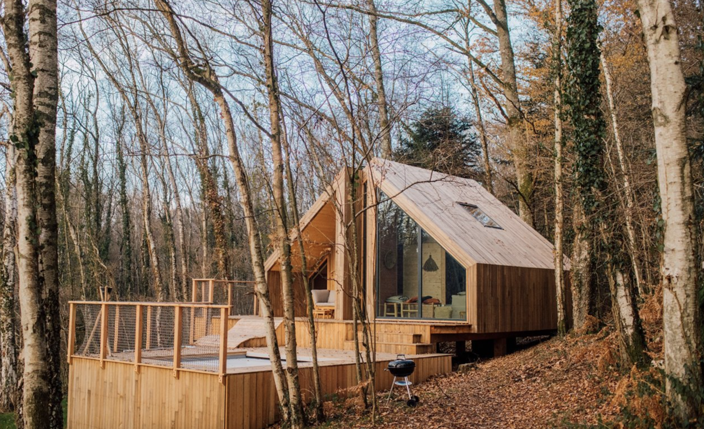

# 🏕️ Nordika Cabins

> Plataforma web de reservas de cabañas y experiencias en entornos naturales.

**Proyecto académico realizado para la Facultad de Ingeniería de la Universidad de Buenos Aires (FIUBA), durante el 2.º cuatrimestre de 2025, para la materia Introducción al Desarrollo de Software, cátedra Lanzillotta.**



## 📖 Sobre el proyecto

Nordika Cabins es una aplicación web full-stack orientada a la gestión y reserva de cabañas turísticas. El sistema permite a los usuarios explorar los alojamientos disponibles, consultar sus características y ubicación, seleccionar fechas de estadía, incorporar experiencias adicionales y gestionar una reserva existente.

El proyecto implementa una arquitectura dividida en dos aplicaciones Flask:

- **Frontend:** servidor web encargado de renderizar las páginas, mantener el flujo de navegación y comunicarse con la API.
- **Backend:** API REST encargada de la lógica de negocio, validaciones, persistencia de datos y envío de correos.
- **Base de datos:** MySQL, con un esquema relacional que almacena alojamientos, reservas, imágenes, experiencias y opiniones.

La aplicación está pensada como un sistema académico de reservas, por lo que algunas operaciones —como el pago— están simuladas.

## ✨ Funcionalidades principales

### 🏡 Exploración de cabañas

- Página de inicio con presentación de Nordika Cabins.
- Sección de información institucional.
- Galería de cabañas con filtros por alojamiento.
- Información visual mediante galerías de imágenes.
- Datos de capacidad, habitaciones, baños, superficie, amenities y política de mascotas.
- Ubicación de cada alojamiento mediante mapas embebidos de Google Maps.

### 📅 Reserva de una cabaña

- Selección de una cabaña mediante su `slug`.
- Calendario interactivo para seleccionar check-in y check-out.
- Visualización de reservas existentes para evitar superposiciones.
- Restricción de selección de fechas pasadas.
- Cálculo automático del total según la cantidad de noches y el precio por noche.
- Validación de capacidad máxima del alojamiento.
- Validación del formato del correo electrónico.
- Validación de disponibilidad en el backend antes de crear la reserva.

### 🌲 Experiencias adicionales

La reserva puede incluir experiencias adicionales. Cada experiencia posee nombre, descripción, capacidad, imagen y precio.

Las experiencias pueden:

- seleccionarse durante la creación de la reserva;
- consultarse posteriormente;
- agregarse a una reserva existente;
- quitarse de una reserva existente;
- actualizar el total de la reserva automáticamente.

### 📩 Confirmación por correo

Una vez creada una reserva, el backend construye un correo HTML con los datos de la estadía y las experiencias seleccionadas mediante una plantilla Jinja2.

El envío se realiza utilizando **Flask-Mail** y un servidor SMTP de Gmail.

### 🔎 Gestión de reservas

Desde la sección **Mis Reservas** se puede consultar una reserva utilizando su identificador.

El sistema muestra información como:

- alojamiento reservado;
- fechas de entrada y salida;
- cantidad de huéspedes;
- total;
- datos del cliente;
- estado de la reserva;
- experiencias asociadas.

También existe la posibilidad de:

- cancelar una reserva;
- modificar sus experiencias;
- simular el pago y pasar la reserva a estado `confirmada`.

### ⭐ Opiniones

Los usuarios pueden enviar opiniones vinculadas a una reserva.

Las opiniones almacenan:

- nombre;
- cabaña;
- contacto;
- identificador de reserva;
- puntuación;
- comentario;
- sugerencia.

Las opiniones existentes se consultan desde el backend y se muestran en la página principal.

## 🧰 Stack tecnológico

| Capa | Tecnologías |
|---|---|
| Backend | Python, Flask |
| API | Flask + JSON/REST |
| Comunicación entre aplicaciones | `requests` |
| CORS | `flask-cors` |
| Emails | `Flask-Mail` + SMTP de Gmail |
| Base de datos | MySQL |
| Driver MySQL | `mysql-connector-python` |
| Frontend | HTML5, CSS3, JavaScript |
| Motor de templates | Jinja2, integrado con Flask |
| UI | Bootstrap |
| JavaScript | jQuery |
| Galerías/filtros | Isotope |
| Iconos | Themify Icons |
| Calendario | FullCalendar 5.11.3 |
| Scripts de ejecución | Bash |

Las dependencias Python declaradas por el proyecto son `Flask`, `flask-cors`, `Flask-Mail`, `mysql-connector-python` y `requests`.

## 🏗️ Arquitectura

```text
┌──────────────────────────────┐
│          Navegador           │
│ HTML + CSS + JS + Bootstrap  │
└──────────────┬───────────────┘
               │
               │ HTTP
               ▼
┌──────────────────────────────┐
│       Frontend - Flask       │
│          Puerto 5002         │
│                              │
│  • Renderizado Jinja2        │
│  • Sesión de reserva         │
│  • Formularios               │
│  • requests → Backend        │
└──────────────┬───────────────┘
               │
               │ HTTP / JSON
               ▼
┌──────────────────────────────┐
│       Backend - Flask        │
│          Puerto 5003         │
│                              │
│  • API REST                  │
│  • Validaciones              │
│  • Reservas                  │
│  • Experiencias              │
│  • Opiniones                 │
│  • Emails                    │
└──────────────┬───────────────┘
               │
               │ mysql-connector-python
               ▼
┌──────────────────────────────┐
│            MySQL             │
│       sistema_reservas       │
└──────────────────────────────┘
```

El **frontend escucha en `localhost:5002`** y consume la API del backend en **`localhost:5003`**. El backend, a su vez, se conecta a MySQL utilizando `mysql-connector-python`.

## 🔌 API del backend

### Alojamientos

| Método | Endpoint | Descripción |
|---|---|---|
| `GET` | `/api/cabanas` | Devuelve todos los alojamientos junto con sus imágenes. |
| `GET` | `/api/cabanas/<slug>` | Devuelve los datos de un alojamiento específico. |
| `GET` | `/api/servicios` | Devuelve todas las experiencias/servicios disponibles. |

### Reservas

| Método | Endpoint | Descripción |
|---|---|---|
| `GET` | `/api/reservas/<slug>` | Devuelve las reservas no canceladas y futuras de una cabaña. |
| `GET` | `/api/reservas/<id_reserva>` | Devuelve los datos de una reserva específica. |
| `POST` | `/api/reservas` | Crea una reserva y sus experiencias en una misma transacción. |
| `PATCH` | `/api/reservas/cancelar/<id_reserva>` | Marca una reserva como cancelada. |
| `GET` | `/api/reservas/<id_reserva>/experiencias` | Consulta las experiencias asociadas. |
| `POST` | `/api/reservas/<id_reserva>/experiencias` | Actualiza las experiencias de una reserva. |
| `POST` | `/api/reservas/enviar-mail/<id_reserva>` | Envía manualmente el correo de confirmación. |
| `PATCH` | `/api/reservas/pagar/<id_reserva>` | Simula el pago y marca la reserva como confirmada. |

### Opiniones

| Método | Endpoint | Descripción |
|---|---|---|
| `POST` | `/api/comentarios` | Guarda una nueva opinión asociada a una reserva existente. |
| `GET` | `/api/opiniones` | Devuelve las opiniones almacenadas. |

## ✅ Validaciones implementadas

El backend valida las condiciones críticas antes de confirmar una reserva:

- el check-in debe ser anterior al check-out;
- el check-in no puede estar en el pasado;
- la cantidad de huéspedes no puede superar la capacidad de la cabaña;
- el email debe respetar un formato válido;
- las fechas no pueden superponerse con otra reserva activa;
- los campos obligatorios deben estar presentes;
- las experiencias enviadas deben contener identificadores válidos.

La creación de la reserva y sus experiencias se realiza dentro de una misma transacción de base de datos. Si ocurre un error durante ese proceso, se realiza `rollback`.

## 🗄️ Base de datos

El proyecto utiliza la base de datos **`sistema_reservas`**.

### Modelo relacional

```text
alojamientos
    │
    ├──────────────< imagenes_alojamiento
    │
    └──────────────< reserva
                       │
                       └──────────────< servicios_reserva >────────────── servicios_extras
                       │
                       └──────────────< opiniones
```

### Tablas

#### `alojamientos`

Información principal de cada cabaña:

- `id_alojamiento`
- `name`
- `slug`
- `ubicacion_mapa`
- `ubicacion`
- `ubicacion_nombre`
- `precio_por_noche`
- `capacidad`
- `amenities`
- `metros_cuadrados`
- `baños`
- `dormitorios`
- `petFriendly`

#### `reserva`

Información de cada reserva:

- `id_reserva`
- `id_alojamiento`
- `check_in`
- `check_out`
- `cant_personas`
- `total`
- `nombre`
- `email`
- `telefono`
- `estado`
- `fecha_reserva`

Los estados posibles definidos por el esquema son:

```text
pendiente
confirmada
cancelada
```

#### `servicios_extras`

Catálogo de experiencias:

- `id_servicio`
- `title`
- `subdesc`
- `src`
- `capacidad`
- `precio`

#### `servicios_reserva`

Tabla intermedia entre reservas y experiencias.

#### `imagenes_alojamiento`

Galería de imágenes asociada a cada alojamiento.

#### `opiniones`

Comentarios y puntuaciones vinculados a una reserva.

## 🏕️ Datos iniciales incluidos

El archivo `backend/base_de_datos/valores_iniciales.sql` carga cuatro alojamientos de demostración:

| Cabaña | Capacidad | Superficie | Baños | Dormitorios | Mascotas |
|---|---:|---:|---:|---:|---|
| **Mirador del Sol** | 4 | 120 m² | 2 | 2 | ✅ |
| **Bosque Vivo** | 3 | 90 m² | 1 | 2 | ❌ |
| **Rincón Lunar** | 2 | 70 m² | 1 | 1 | ❌ |
| **Río Nativo** | 3 | 80 m² | 1 | 1 | ✅ |

El mismo script incorpora seis experiencias adicionales:

1. Aventura en el bosque
2. Paseo natural
3. Trekking por las montañas
4. Meditación en el bosque
5. Paseo nocturno en el bosque
6. Paseo en barco por el río del bosque

También carga las galerías de imágenes correspondientes a las cabañas.

## 📁 Estructura del proyecto

```text
NordikaCabins/
├── backend/
│   ├── base_de_datos/
│   │   ├── schema.sql
│   │   └── valores_iniciales.sql
│   ├── templates/
│   │   └── confirmacion_reserva_email.html
│   ├── app.py
│   ├── db.py
│   └── .gitkeep
│
├── frontend/
│   ├── static/
│   │   ├── css/
│   │   │   ├── leadmark.css
│   │   │   └── reservar.css
│   │   ├── imgs/
│   │   │   ├── logo.svg
│   │   │   ├── header*.jpg/jpeg
│   │   │   ├── about-image.jpg
│   │   │   ├── section.jpg
│   │   │   ├── video-cabaña.mp4
│   │   │   ├── mirador-sol-*.jpg
│   │   │   ├── bosque-vivo-*.jpg
│   │   │   ├── rincon-lunar-*.jpg
│   │   │   ├── rio-nativo-*.jpg
│   │   │   └── experiencia-*.jpg
│   │   ├── js/
│   │   │   ├── leadmark.js
│   │   │   ├── main.js
│   │   │   └── reservar-logica.js
│   │   └── vendors/
│   │       ├── bootstrap/
│   │       ├── isotope/
│   │       ├── jquery/
│   │       └── themify-icons/
│   ├── templates/
│   │   ├── base.html
│   │   ├── comentarios.html
│   │   ├── confirmacion_reserva_email.html
│   │   ├── error_handle.html
│   │   ├── index.html
│   │   ├── ingreso_datos.html
│   │   ├── mis_reservas.html
│   │   ├── nuestras_cabañas.html
│   │   └── reservar_cabaña.html
│   ├── app.py
│   └── crearentorno.sh
│
├── iniciar_pagina.sh
└── requirements.txt
```

## 🚀 Instalación

### 1. Clonar el repositorio

```bash
git clone https://github.com/nicoaraujoo07/NordikaCabins.git
cd NordikaCabins
```

### 2. Crear un entorno virtual

Una opción simple es utilizar `venv`:

```bash
python3 -m venv .venv
source .venv/bin/activate
```

En Windows, utilizando PowerShell:

```powershell
.venv\Scripts\Activate.ps1
```

### 3. Instalar dependencias

```bash
pip install -r requirements.txt
```

### 4. Configurar MySQL

Crear la base de datos y sus tablas ejecutando:

```bash
mysql -u root -p < backend/base_de_datos/schema.sql
```

Luego cargar los datos de ejemplo:

```bash
mysql -u root -p sistema_reservas < backend/base_de_datos/valores_iniciales.sql
```

El archivo `backend/db.py` espera actualmente una conexión local con:

```text
host=localhost
user=root
database=sistema_reservas
```

La contraseña debe configurarse para la instalación local. **No se deben utilizar ni subir credenciales reales al repositorio.**

### 5. Configurar el correo

El backend utiliza `Flask-Mail` y SMTP de Gmail para enviar los correos de confirmación.

La configuración se encuentra actualmente en `backend/app.py`. Para una instalación real conviene mover el servidor, usuario, contraseña y demás credenciales a variables de entorno.

### 6. Iniciar el backend

Desde la raíz del proyecto:

```bash
python3 backend/app.py
```

El backend queda disponible en:

```text
http://localhost:5003
```

### 7. Iniciar el frontend

En otra terminal, con el mismo entorno virtual activo:

```bash
python3 frontend/app.py
```

El frontend queda disponible en:

```text
http://localhost:5002
```

> **Importante:** el frontend consulta `/api/cabanas` y `/api/servicios` al momento de importar `frontend/app.py`, por lo que el backend debe estar disponible antes de iniciar el frontend.

## 🖥️ Flujo de uso

```text
Inicio
  │
  ├── Ver cabañas
  │       │
  │       └── Seleccionar cabaña
  │                │
  │                └── Elegir fechas
  │                         │
  │                         └── Verificar disponibilidad
  │                                  │
  │                                  └── Ingresar datos
  │                                           │
  │                                           ├── Seleccionar experiencias
  │                                           │
  │                                           └── Crear reserva
  │                                                    │
  │                                                    ├── Guardar en MySQL
  │                                                    └── Enviar confirmación por email
  │
  └── Mis Reservas
           │
           ├── Consultar por ID
           ├── Actualizar experiencias
           ├── Cancelar reserva
           └── Simular pago
```

## 🎨 Frontend y recursos visuales

La interfaz utiliza una adaptación de **LeadMark**, complementada con Bootstrap, jQuery, Isotope y Themify Icons.

El repositorio incluye recursos locales para evitar depender de la mayoría de los assets visuales principales:

- logo SVG;
- imágenes de portada;
- imágenes de cada cabaña;
- imágenes de experiencias;
- video promocional;
- hojas de estilo;
- bibliotecas JavaScript de terceros.

La página de reserva utiliza **FullCalendar 5.11.3** desde CDN para el calendario interactivo.

## 🔐 Consideraciones de seguridad

Este repositorio fue desarrollado como proyecto académico. Antes de utilizarlo en producción deberían realizarse, como mínimo, los siguientes cambios:

- sacar las credenciales SMTP del código fuente;
- utilizar variables de entorno o un gestor de secretos;
- sacar las credenciales de MySQL del código fuente;
- cambiar la `SECRET_KEY` por una clave segura en producción;
- agregar autenticación/autorización para acceder a una reserva;
- validar y controlar con mayor rigor los datos enviados por el cliente;
- proteger los endpoints sensibles contra solicitudes arbitrarias;
- agregar protección CSRF para los formularios apropiados;
- utilizar HTTPS;
- añadir manejo estructurado de logs y errores.

> ⚠️ **Importante:** en el estado actual del repositorio existe una configuración SMTP con credenciales directamente en `backend/app.py`. Antes de mantener el repositorio público o reutilizarlo, esa credencial debe revocarse/rotarse y reemplazarse por configuración segura mediante variables de entorno.

## ⚠️ Observaciones sobre el estado actual del repositorio

La documentación de este README describe el código tal como se encuentra en el repositorio. Hay algunos puntos que deben tenerse en cuenta al ejecutar el proyecto:

### `iniciar_pagina.sh`

El script raíz intenta ejecutar:

```bash
python3 backend/app_back.py
```

pero el archivo existente en el repositorio es:

```text
backend/app.py
```

Por este motivo, para evitar ese desfasaje conviene iniciar los dos servidores manualmente con los comandos indicados anteriormente o corregir el script.

### Métodos HTTP de cancelación y pago

El backend declara:

```text
PATCH /api/reservas/cancelar/<id>
PATCH /api/reservas/pagar/<id>
```

mientras que algunas llamadas del frontend utilizan `POST` para esas operaciones. Esa diferencia debe unificarse para que ambos lados utilicen el mismo método HTTP.

### Hoja de estilos de ingreso de datos

`frontend/templates/ingreso_datos.html` referencia `static/css/ingreso_datos.css`, pero el directorio `frontend/static/css` versionado actualmente contiene `leadmark.css` y `reservar.css`. Si se necesita ese estilo separado, el archivo deberá agregarse o la referencia deberá corregirse.

### `main.js`

Existe un `frontend/static/js/main.js` que contiene lógica para una estructura de datos de cabañas diferente a la que utiliza actualmente el template `index.html`. El frontend actual construye la galería principal mediante Jinja2, por lo que este archivo parece corresponder a una implementación anterior o alternativa.

## 🧪 Estado del proyecto

**Tipo:** proyecto académico / sistema de reservas web.

**Período:** 2.º cuatrimestre de 2025.

**Materia:** Introducción al Desarrollo de Software.

**Institución:** Facultad de Ingeniería, Universidad de Buenos Aires (FIUBA).

**Cátedra:** Lanzillotta.

El proyecto se encuentra orientado a demostrar la integración entre una interfaz web, un backend con API REST, una base de datos relacional y servicios externos como SMTP y Google Maps.

## 📚 Archivos importantes

| Archivo | Función |
|---|---|
| `backend/app.py` | API, lógica de negocio y correo |
| `backend/db.py` | Conexión con MySQL |
| `backend/base_de_datos/schema.sql` | Creación del esquema |
| `backend/base_de_datos/valores_iniciales.sql` | Datos iniciales |
| `backend/templates/confirmacion_reserva_email.html` | Plantilla de confirmación por correo |
| `frontend/app.py` | Servidor web y flujo de navegación |
| `frontend/templates/*.html` | Vistas Jinja2 |
| `frontend/static/js/reservar-logica.js` | Lógica del calendario y cálculo del total |
| `frontend/static/js/leadmark.js` | Interacciones visuales, navegación y carruseles |
| `requirements.txt` | Dependencias Python |
| `iniciar_pagina.sh` | Script de inicio conjunto de servidores |
| `frontend/crearentorno.sh` | Script histórico para preparar un entorno con Pipenv |

## 📝 Dependencias declaradas

El archivo `requirements.txt` contiene:

```text
Flask
flask-cors
Flask-Mail
mysql-connector-python
requests
```

Las versiones no están fijadas en el archivo, por lo que la reproducibilidad exacta del entorno depende de las versiones disponibles al momento de la instalación.

## 📄 Licencia

El repositorio no incluye actualmente un archivo `LICENSE`, por lo que **no declara una licencia de uso, modificación o distribución**.

## 🎓 Contexto académico

Nordika Cabins fue desarrollado como trabajo práctico para la materia **Introducción al Desarrollo de Software** de la **Facultad de Ingeniería de la Universidad de Buenos Aires**, dentro de la **cátedra Lanzillotta**, durante el **2.º cuatrimestre de 2025**.

El proyecto reúne conceptos de desarrollo web, arquitectura cliente-servidor, APIs REST, persistencia de datos, validación de formularios, manejo de sesiones, integración con servicios externos y organización de un proyecto full-stack.

---

<p align="center">
  <strong>Nordika Cabins</strong><br>
  Diseño y calma, integrado con software.
</p>
